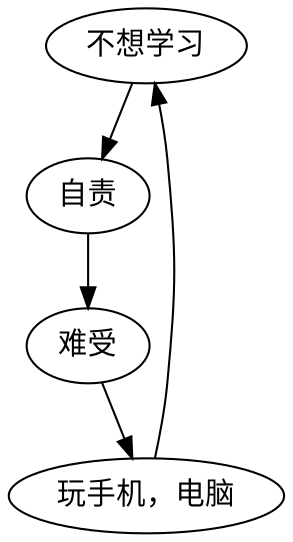

# 手机成瘾的心理学原理和应用

## 多巴胺反馈机制
多巴胺代表的是对快感的预期。
我们享受的是玩手机的反馈预期。
行为++>正向反馈++>多巴胺++>驱动学习。
下个视频可能会很有趣，是沉迷于小视频的根本原因。

## 成瘾的心理因素
### 未知预期。
1. ==温故知新==
### 及时反馈。
==反馈周期越短==，需要的耐心越低。成瘾越有可能。
### 三种反馈机制（正反馈强化）
视觉反馈，情绪反馈，互动反馈。
### 三种反馈弱化（负反馈弱化）
1. 走位： 灵活安排任务，攻坚之后，立刻复习
2. 治疗： 将负反馈给限制，保证不会扩大化到学习本身，自我认知，做到就事论事。达克效应。高效能人士的7个习惯
3. 格挡： 闻过则喜，乐观，辩证，
## 推荐算法协助内容成瘾

## 应用
1. 将大的任务分解，每完成一个**小任务**就自我反馈。（不能太小，不能太大，总的任务安排要休息，休息结束后要继续）
2. 多做笔记，多思考，要有**互动**。这个互动要尽量简单，或者充满成就感。
3. 你必须保证自己对下一个题目（知识点）的**未知性**（**新鲜感**）。不能死板的要求未知，在实际过程中要有一定的总体上的把握。
4. 费曼学习法。
5. 休息时间不妨进行反思。进行自我反馈。
6. 不能过分地压榨自己的精力，去做一些自己已经产生抵触情绪的工作。注意休息，工作内容适度交叉转换，调节负面印象。

## 学习相关的其他技巧。
1. 费曼技巧：
假设你正在向一个什么都不懂的学生讲解你正在学习的知识，用最简短的话语来使他理解。这样的学习方法就是费曼技巧。
原理，教学相长。
2. 记忆宫殿
把要记忆的内容，与自己生活空间内的物品相关联，记住该物品的特征与位置。当你需要回想起该知识的时候，就回想那个物品，然后就会自然而然地想起该知识。
3. 练习。
通过做练习题来巩固自己已学的知识。
熟能生巧。
4. 蔡格尼克效应。
你对未完成的事的记忆效果比已完成的事的记忆效果要好。
5. 分散学习。
分散学习的效果要强于集中学习。

## 注意
- ==及时反馈==。

- 题目难度认知。=== 题目难 === **知识掌握不全面，不深入，不系统**。！== 自己笨。粗心，等等
- 自我能力认知。（ ==达克效应==）。
- ==二十四英里法则==
- ==飞轮效应==
- ==蔡格尼克效应==
- ==认知吝啬者==
- ==风险补偿==
- ==精力管理==（情绪，心理，自我认知，体能，意志）
- ==理性情绪行为疗法==
- 锻炼。
- ==梯度刷题==。
- ==错题整理==
- ==复习==
- 答案的合理使用
- ==系统学习==。
- ==费曼技巧==
- ==练习==
- **提问式思考。**
- **信念。（不断地重复；我要学习。）**
- **从别人的角度思考。**
- 以**联系的观点**看待知识。
## 不想学习的恶性循环
